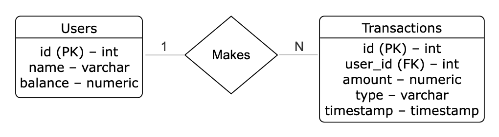

# Bank App: Simple Web-Based Banking Service

## 1. Project Overview

This is a minimal **Flask-based web application** that allows users to:

- **Create an account**
- **Check their balance**
- **Deposit money**

All data is stored in **PostgreSQL**, using the following tables:

- `users(id PK, name, balance)`
- `transactions(id PK, user_id FK → users.id, amount, type, timestamp)`

---

## 2. ER Diagram

Below is the Entity-Relationship (ER) diagram representing the database schema:



### Tables

- **`users`**
  - `id` – *Primary Key (auto-increment)*
  - `name` – *Validated with regex (letters only)*
  - `balance` – *Current account balance (NUMERIC)*

- **`transactions`**
  - `id` – *Primary Key (auto-increment)*
  - `user_id` – *Foreign Key → `users.id`*
  - `amount` – *Deposit/withdrawal amount (NUMERIC)*
  - `type` – *Transaction type (e.g., "deposit")*
  - `timestamp` – *Defaults to `CURRENT_TIMESTAMP`*

### Relationship

- A single **user** can make **multiple transactions**.

---

## 3. Prerequisites

- macOS/Linux (Windows users can adapt accordingly)
- Python 3.x
- Homebrew (or another package manager)
- PostgreSQL
- Git

---

## 4. Setup Instructions

### 4.1 Clone the Repository

```bash
cd ~
mkdir -p projects
cd projects
git clone git@git.ku.dk:mhz351/bank-app.git
cd bank-app
```

---

### 4.2 Create and Activate a Python Virtual Environment

```bash
python3 -m venv venv
source venv/bin/activate  # On macOS/Linux
```

> On Windows (PowerShell):
```powershell
.\venv\Scripts\Activate.ps1
```

---

### 4.3 Install Python Dependencies

Ensure `requirements.txt` includes:

```
Flask>=2.0
psycopg2-binary
```

Then run:

```bash
pip install --upgrade pip
pip install -r requirements.txt
```

---

### 4.4 Start PostgreSQL

```bash
brew services start postgresql  # macOS
sudo service postgresql start   # Linux
```

---

### 4.5 Create PostgreSQL Role and Database

#### 4.5.1 Enter psql as Superuser

```bash
psql postgres
```

#### 4.5.2 Create Role (replace password accordingly)

```sql
CREATE ROLE mhz351 WITH LOGIN PASSWORD 'Magnum99';
ALTER ROLE mhz351 CREATEDB;
\q
```

> `WITH LOGIN` allows login access.  
> `CREATEDB` grants database creation rights.

#### 4.5.3 Create the Database

```bash
psql -U mhz351 -d postgres -c "CREATE DATABASE bankdb;"
```

---

### 4.6 Load Database Schema

Ensure your `sql_ddl/schema.sql` includes:

```sql
CREATE TABLE users (
    id      SERIAL PRIMARY KEY,
    name    VARCHAR(50) NOT NULL,
    balance NUMERIC NOT NULL DEFAULT 0
);

CREATE TABLE transactions (
    id         SERIAL PRIMARY KEY,
    user_id    INTEGER NOT NULL REFERENCES users(id),
    amount     NUMERIC NOT NULL,
    type       VARCHAR(20) NOT NULL,
    timestamp  TIMESTAMP NOT NULL DEFAULT CURRENT_TIMESTAMP
);
```

Then execute:

```bash
psql -U mhz351 -d bankdb -f sql_ddl/schema.sql
```

---

### 4.7 Configure Database in `run.py`

Edit the `DB_CONFIG` dictionary in `run.py`:

```python
DB_CONFIG = {
    "host":     "localhost",
    "database": "bankdb",
    "user":     "mhz351",
    "password": "Magnum99"
}
```

---

### 4.8 Run the Flask Server

```bash
python run.py
```

Expected output:

```
 * Serving Flask app "run.py"
 * Debug mode: on
 * Running on http://127.0.0.1:5000/ (Press CTRL+C to quit)
```

---

## 5. Interacting with the API

### 5.1 Create a New User

```bash
curl -X POST http://127.0.0.1:5000/users \
     -H "Content-Type: application/json" \
     -d '{"name":"Alice"}'
```

**Response (201):**

```json
{
  "id": 1,
  "name": "Alice",
  "balance": 0
}
```

---

### 5.2 List All Users

```bash
curl http://127.0.0.1:5000/users
```

**Response (200):**

```json
[
  {
    "id": 1,
    "name": "Alice",
    "balance": 0
  }
]
```

---

### 5.3 Deposit Money

```bash
curl -X POST http://127.0.0.1:5000/deposit \
     -H "Content-Type: application/json" \
     -d '{"user_id":1,"amount":100}'
```

**Response (200):**

```json
{
  "id": 1,
  "new_balance": 100
}
```

---

### 5.4 Verify Updated Balance

```bash
curl http://127.0.0.1:5000/users
```

**Response (200):**

```json
[
  {
    "id": 1,
    "name": "Alice",
    "balance": 100
  }
]
```

---

## 6. Input Validation (Regex)

In `run.py`, the `/users` endpoint includes:

```python
import re

@app.route("/users", methods=["POST"])
def create_user():
    data = request.get_json()
    name = data.get("name", "").strip()
    if not name or not re.fullmatch(r"[A-Za-z]+", name):
        return jsonify({"error": "Invalid name; only letters A–Z are allowed"}), 400
```

This ensures that names only contain English letters (no digits or special characters).
